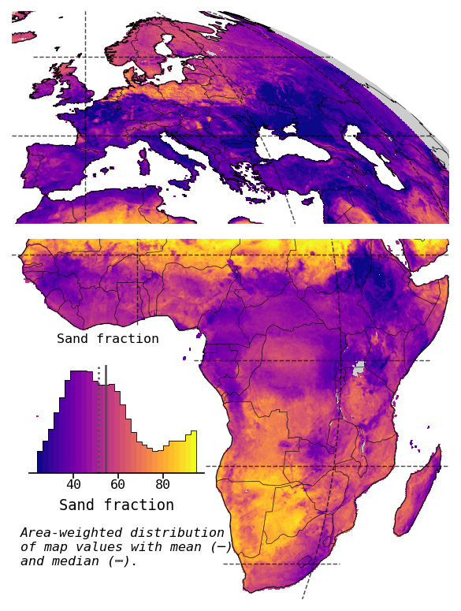
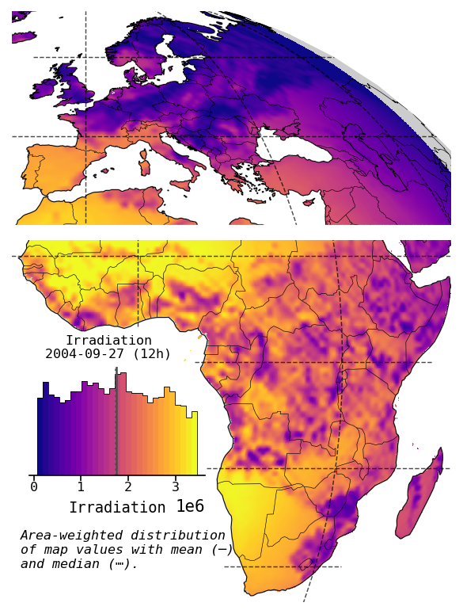
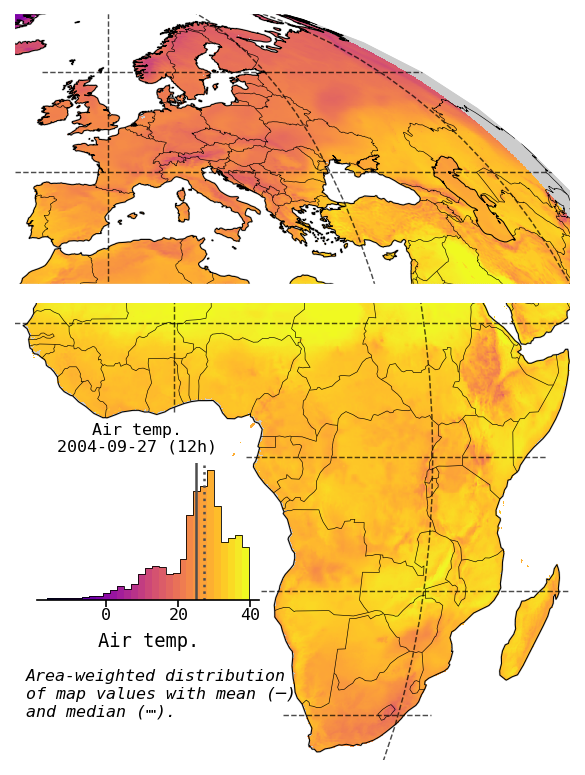
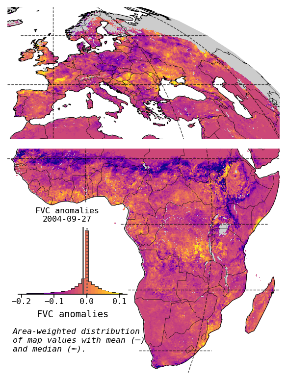

# Drought ML

**This is work in progress**

### Objective 1

Build a temporal model of fractional vegetation cover (FVC) anomalies and land surface temperature (LST) anomelies with meteorology and geofactors as covariates.

Model types:
* LSTM
* TCN
* Self attention

(more to come)

### Objective 2

Interpret the model using XAI.

(more to come)

## Background

### Static features (geofactors)

<p float="left">
    
    
    
    
    
    
</p>

### Dynamic features (meteo, hourly)

(From ERA 5 Land)

<p float="left">
    
    
    
    
</p>

### Dynamic targets (hourly, daily)

(From Seviri MSG)

<p float="left">
    
    
</p>

## Getting started

### Install conda & environment

### Envioronment set-up

1. Install conda
1. Create conda environment `dml` by running</br>>>> `bash create_env.sh`
1. Activate conda environment</br>>>> `conda activate dml`

### Preprocessing

1. On any machine with access to `/Net/Groups/BGI`:</br>>>> `bash preprocessing/preproc_par.sh`
1. On the slurm cluster:</br>>>> `bash preprocessing/cube_create.sh`
1. Access cube at</br>>>> `/Net/Groups/BGI/scratch/bkraft/drought_data/cube.zarr`

### Run an experiment on the slurm cluster

We first create an experiment with the run scripts. Here, we chose the LSTM setup with `predict_msc=True` (i.e., we predict anomalies and seasonality concurrently). We can change any training, dataset, or model parameter via the CLI. For a complete list of parameters, run:
</br> >>> `python slurm_interface.py -c project/config/lstm.yaml --search_space project/search_spaces/lstm.yaml --print_config`

```
# pytorch_lightning==1.9.0
seed_everything: 99
trainer:
  logger:
    class_path: pytorch_lightning.loggers.TensorBoardLogger
    init_args:
      save_dir: ./logs
      name: ''
      version: null
      log_graph: false
      default_hp_metric: true
      prefix: ''
      sub_dir: null
  enable_checkpointing: true
  callbacks:
  - class_path: project.utils.pl_utils.OutputWriter
  - class_path: pytorch_lightning.callbacks.EarlyStopping
    init_args:
      monitor: val/loss
      min_delta: 0.0
      patience: 15
      verbose: false
      mode: min
      strict: true
      check_finite: true
      stopping_threshold: null
      divergence_threshold: null
      check_on_train_epoch_end: null
      log_rank_zero_only: false
  - class_path: pytorch_lightning.callbacks.TQDMProgressBar
    init_args:
      refresh_rate: 20
      process_position: 0
  - class_path: pytorch_lightning.callbacks.ModelCheckpoint
    init_args:
      dirpath: null
      filename: best
      monitor: val/loss
      verbose: false
      save_last: true
      save_top_k: 1
      save_weights_only: false
      mode: min
      auto_insert_metric_name: true
      every_n_train_steps: null
      train_time_interval: null
      every_n_epochs: null
      save_on_train_epoch_end: null
  default_root_dir: null
  gradient_clip_val: null
  gradient_clip_algorithm: null
  num_nodes: 1
  num_processes: null
  devices:
  - 0
  gpus: null
  auto_select_gpus: null
  tpu_cores: null
  ipus: null
  enable_progress_bar: true
  overfit_batches: 0.0
  track_grad_norm: -1
  check_val_every_n_epoch: 1
  fast_dev_run: false
  accumulate_grad_batches: null
  max_epochs: 100
  min_epochs: null
  max_steps: -1
  min_steps: null
  max_time: null
  limit_train_batches: null
  limit_val_batches: null
  limit_test_batches: null
  limit_predict_batches: null
  val_check_interval: 0.1
  log_every_n_steps: 1
  accelerator: gpu
  strategy: null
  sync_batchnorm: false
  precision: 32
  enable_model_summary: true
  num_sanity_val_steps: 0
  resume_from_checkpoint: null
  profiler: null
  benchmark: null
  deterministic: null
  reload_dataloaders_every_n_epochs: 0
  auto_lr_find: false
  replace_sampler_ddp: true
  detect_anomaly: false
  auto_scale_batch_size: false
  plugins:
  - class_path: lightning_fabric.plugins.environments.SLURMEnvironment
    init_args:
      auto_requeue: false
      requeue_signal: null
  amp_backend: null
  amp_level: null
  move_metrics_to_cpu: false
  multiple_trainloader_mode: max_size_cycle
  inference_mode: true
data:
  fold_id: 0
  target_daily: fvc
  target_hourly: null
  batch_size: 100
  chunk_buffer_size: 4
  queue_size: 20
  num_queue_workers: 12
  chunk_size: 20
  window_size: 2
  context_size: 2
  full_seq_prediction: true
  n_mask_erode: 0
  disable_shuffling: false
  cube_path: /Net/Groups/BGI/scratch/bkraft/drought_data/cube.zarr
  dummy_data: false
  sampler: null
  batch_sampler: null
  pin_memory: false
  drop_last: false
  timeout: 0.0
  worker_init_fn: null
  multiprocessing_context: null
  generator: null
  prefetch_factor: 2
  persistent_workers: false
  pin_memory_device: ''
search_space: null
ckpt_path: null
optimizer:
  class_path: torch.optim.AdamW
  init_args:
    lr: 0.001
    betas:
    - 0.9
    - 0.999
    eps: 1.0e-08
    weight_decay: 0.001
    amsgrad: false
    maximize: false
    foreach: null
    capturable: false
model:
  class_path: project.pl_models.lstm_model.LSTMPL
  init_args:
    num_hidden: 64
    num_layers: 2
    dropout: 0.1
    static_dropout: 0.1
    num_meteo_enc: 16
    num_geofactors_enc: 3
    predict_msc: false
    predict_var: false
```

You can use a different a model from `project/config/` with its HP search space from `project/search_spaces/`.

To create an experiment (with 32 samples from the search space), we first initialize it with
</br>>>> `python slurm_interface.py -c project/config/lstm.yaml --search_space project/search_spaces/lstm.yaml --num_trials 32 --model.predict_msc true --trainer.max_epochs 50`

The next steps are described in the experiment directory that was just created (by default in `experiments/<job_name>/<experiment_uid>/README.md`)

We can also run a model outside of the experiment routine by using the Lightning CLI interface `cli_inteerface.py`.
