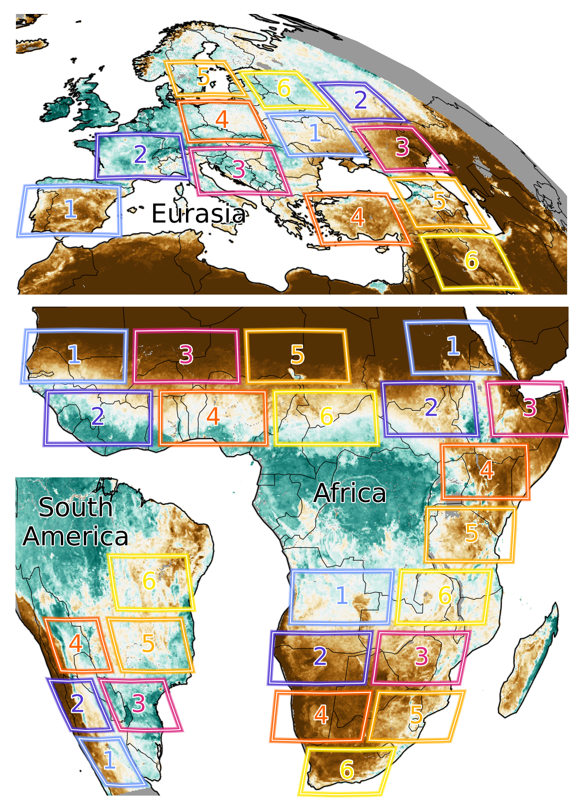
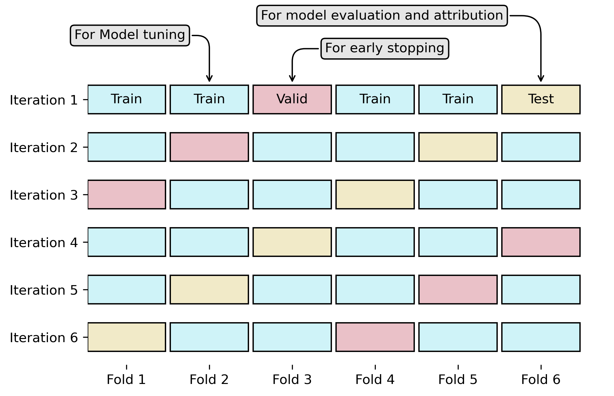
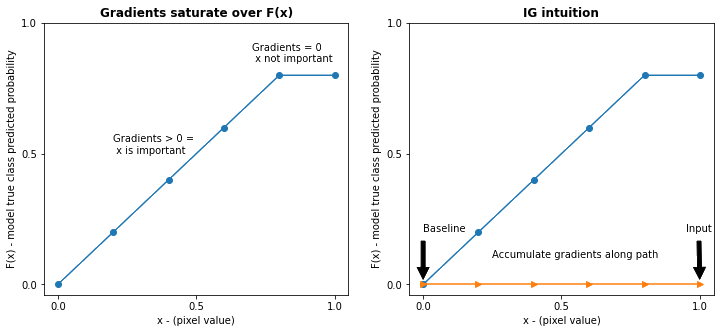
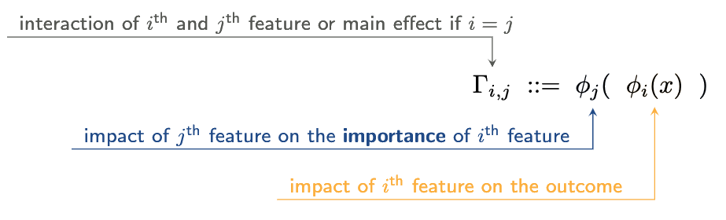
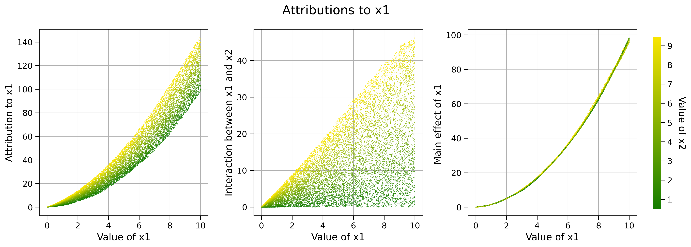
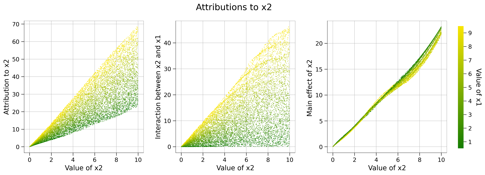

## Undertanding extreme vegetation response with XAI and geostationary ES data

--

### Goals

* Model vegetation state (via FVC) and physiology (via LST) observed by a geostationary satellite and
* apply post-hoc explanations to
    * identify the impact and temporal scales of meteorological drivers on vegetation anomalies,
    * study their interactions with geofactors,
    * identify different "response regimes", and
    * assess the potential of XAI for time series.

--

### Data

<small><small>

Time range: 2002 - 2021

| Variable | Abreviation | Source | Spatial resolution | Temporal resolution | 
| --- | --- | --- | --- | --- |
| **Dynamic features** |
| Air temperature | t2m | ERA5 land | 0.1° | 1 hour |
| Precipitation | tp | ERA5 land | 0.1° | 1 hour |
| Relative humidity | rH | ERA5 land | 0.1° | 1 hour |
| Surface solar radiation downwards | ssrd | ERA5 land | 0.1° | 1 hour |
| **Static features** |
| Topographic index | twi | - | 0.00416° (-> 0.1°) | - |
| Max rooting depth | mrd | Fan | 0.0083° (-> 0.1°) | - |
| Water table depth | wtd | Fan | 0.0083° (-> 0.1°) | - |
| Soil sand content (<1m) | sndppt | soilgrids | 0.002° (-> 0.1°) | - |
| Canopy height | ch | GlobVeg3D | 0.083° (-> 0.1°) | - |
| Percentage tree cover (mean 2003-2019) | tc | MOD44B3 | 0.001° (-> 0.1°) | - |
| **Dynamic targets** |
| Fractional vegetation cover | fvc | Seviri | 0.01° (-> 0.1°) | 1 day |
| Land surface temperature | lst | Seviri | 0.01° (-> 0.1°) | 1 hour |

</small></small>

--

--

### Prediction setup

* Predict one day ahead to avoid effects of targets on inputs 
$y_{\text{fvc}, t, s}, y_{\text{lst}, t, s} = f(X_{\text{met}, <t, s}, X_{\text{static}, s})$
* Predict anomalies as I want to look at extremes and not seasonality (hard to disentangle as we know from Memory paper)
* Use MSC as auxiliary task, because model does not learn anomalies so far (not tested yet) 
$y_{\text{fvc_ano}, t, s}, y_{\text{lst_ano}, t, s}, y_{\text{fvc_msc}, s}, y_{\text{lst_msc}, s} =\\ f(...)$

--

### Spatial domain

--

### Cross-validation

--

### Post-hoc explanations: integrated gradients

<figure>

  <figcaption>Local attribution method: how does feature $x_i$ impact the model prediction?</figcaption>
</figure>

--

### Post-hoc explanations: integrated hessians

<figure>

  <figcaption>With integrated Hessians, we also get interactions.</figcaption>
</figure>

--

### Post-hoc explanations: integrated hessians

<figure>

  <figcaption>Attributions to $x_1$ (top) and $x_2$(bottom) for the function $y = x_1^2 + 2 x_2 + x_1 x_2 + e$ with
zero-baseline.</figcaption>
</figure>

--

### Post-hoc explanations: integrated hessians

How to chose a baseline?

* For meteorology: MSC (?)
* For geofactors: global mean?

Another option: expected hessians, where we integrate from randomly drawn samples.

--

### Some nice properties of integrated gradients / hessians

* **Completeness |** The impact is in units of the target and the sum of the impacts adds up to the change in $f(x) - f(x')$
* **Sensitivity |** If a features changes the prediction, it must have non-zero attribution.
* **Implementation invariance |** If two models yield the same predictions, their attribution must be the same

--

### Work done so far

* Data processing (with MSC and anomalies for targets): INT16 + compressed ~600GB
* Super fast data pipeline :)
* Some basic models (LSTM and convolution-based)
* Ready to start!

--

### Discussion

* Objectives
* Prediction setup
* Data
* XAI
* Schedule
* Meetings
