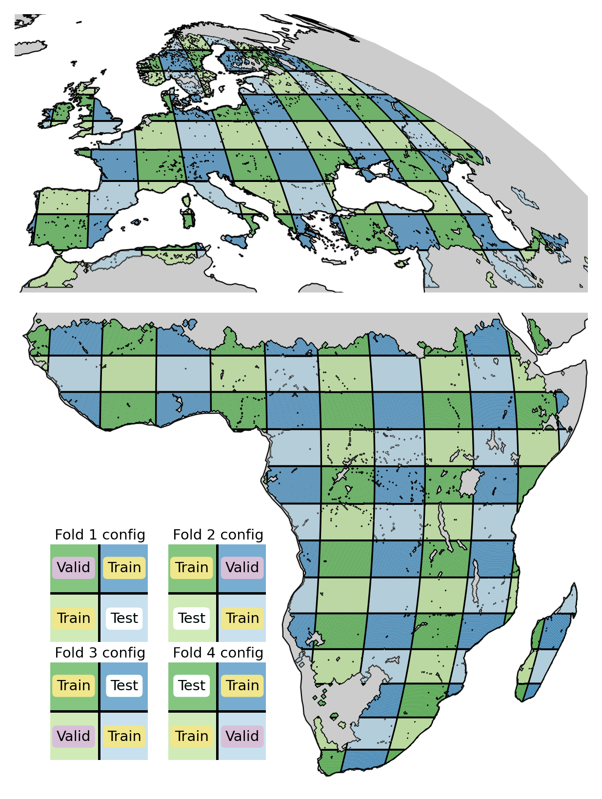
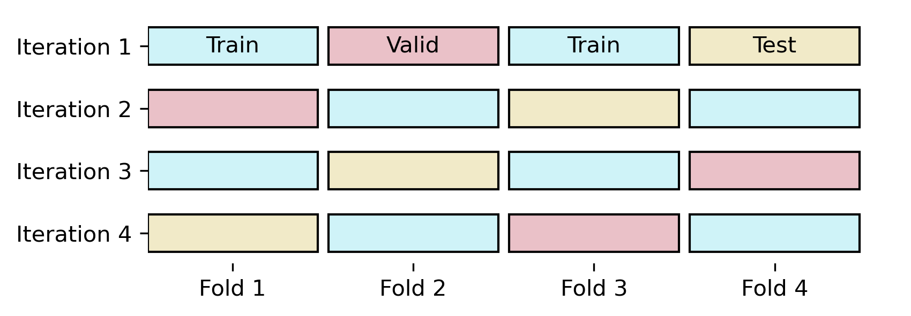

## Undertanding extreme vegetation response with XAI and geostationary ES data

--

### Goals

* Model vegetation state (via FVC) and physiology (via LST) observed by a geostationary satellite and
* apply post-hoc explanations to
    * identify the impact and temporal scales of meteorological drivers on vegetation anomalies,
    * study their interactions with geofactors,
    * identify different "response regimes", and
    * assess the potential of XAI for time series.

--

### Data

<small><small>

Time range: 2002 - 2021

| Variable | Abreviation | Source | Spatial resolution | Temporal resolution | 
| --- | --- | --- | --- | --- |
| **Dynamic features** |
| Air temperature | t2m | ERA5 land | 0.1° | 1 hour |
| Precipitation | tp | ERA5 land | 0.1° | 1 hour |
| Relative humidity | rH | ERA5 land | 0.1° | 1 hour |
| Surface solar radiation downwards | ssrd | ERA5 land | 0.1° | 1 hour |
| **Static features** |
| Topographic index | twi | - | 0.00416° (-> 0.1°) | - |
| Max rooting depth | mrd | Fan | 0.0083° (-> 0.1°) | - |
| Water table depth | wtd | Fan | 0.0083° (-> 0.1°) | - |
| Soil sand content (<1m) | sndppt | soilgrids | 0.002° (-> 0.1°) | - |
| Canopy height | ch | GlobVeg3D | 0.083° (-> 0.1°) | - |
| Percentage tree cover (mean 2003-2019) | tc | MOD44B3 | 0.001° (-> 0.1°) | - |
| **Dynamic targets** |
| Fractional vegetation cover | fvc | Seviri | 0.01° (-> 0.1°) | 1 day |
| Land surface temperature | lst | Seviri | 0.01° (-> 0.1°) | 1 hour |

</small></small>

--

### Spatial domain & CV scheme

--

### Cross validation

