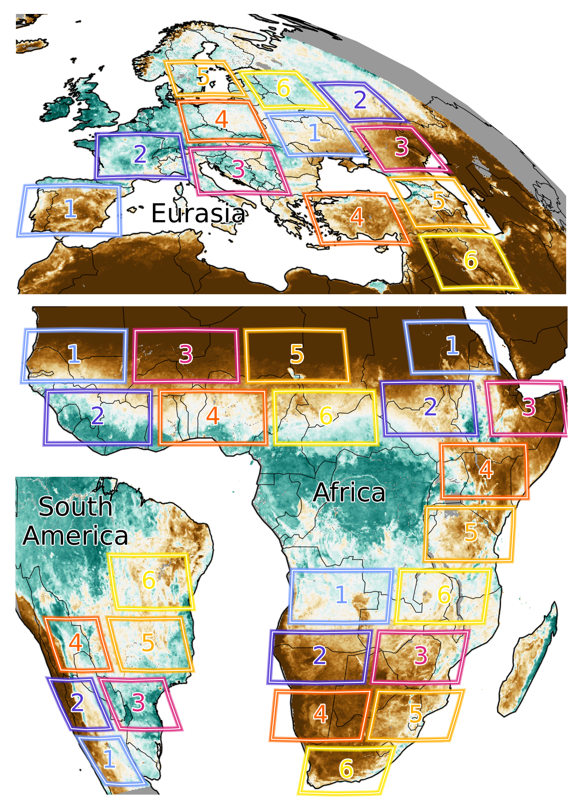
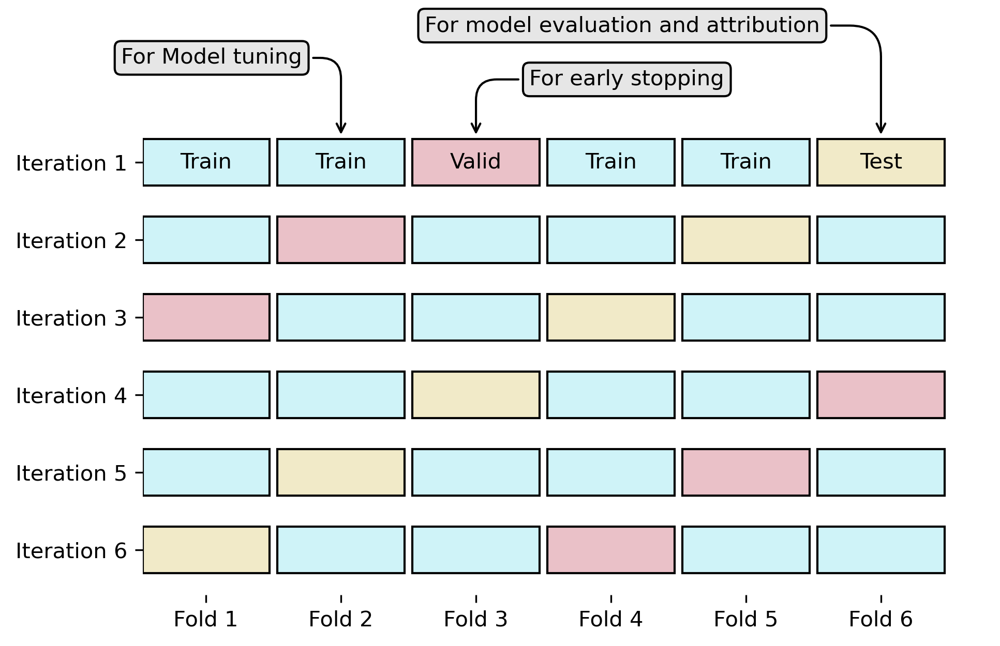

## Data

| Variable | Abreviation | Source | Spatial resolution | Temporal resolution | 
| --- | --- | --- | --- | --- |
| **Dynamic features** |
| Air temperature | t2m | ERA5 land | 0.1° | 1 hour |
| Precipitation | tp | ERA5 land | 0.1° | 1 hour |
| Relative humidity | rH | ERA5 land | 0.1° | 1 hour |
| Surface solar radiation downwards | ssrd | ERA5 land | 0.1° | 1 hour |
| **Static features** |
| Topographic index | twi | - | 0.00416° (-> 0.1°) | - |
| Max rooting depth | mrd | Fan | 0.0083° (-> 0.1°) | - |
| Water table depth | wtd | Fan | 0.0083° (-> 0.1°) | - |
| **Dynamic targets** |
| Fractional vegetation cover | fvc | Seviri | 0.01° (-> 0.1°) | 1 day |
| Land surface temperature | lst | Seviri | 0.01° (-> 0.1°) | 1 hour |

## Training setup

* Split disk into 36 regions of interest (ROIs), each 12° (=120 cells lon) x 6° (=60 cells lat), to
    * have a buffer between ROIs (avoid overfitting)
    * avoid the chessboard problem (either buffer and we get ugly maps of no buffer and we may overfit)
    * have ROIs with predictions from same model
    * be able to report average statistics (e.g., attribution, model skill) across (more or less) homogenuous regions
* Rain forests are omitted due to data gaps (coudiness)
* The ROIs are split manually into 6 groups (CV folds)
* A 6fold cross-validation is performed;
    * HP tuning with a small subset of training split (validation set to avoid overfitting)
    * Training is done with the best model, early stopping with validaiton set
    * Final model is applied on the test set. Each ROI is once in the test set

